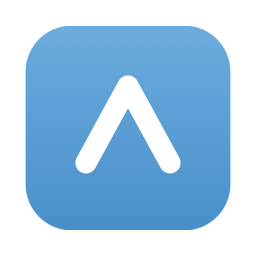

<p align="center">
  
</p>

<h1 align="center">Veil</h1>

<p align="center">
  轻量、原生、为 macOS 打造的代理客户端
</p>

Veil 是一款使用 **SwiftUI + AppKit** 开发的原生 macOS 代理客户端，以 [mihomo](https://github.com/MetaCubeX/mihomo) 作为网络内核。项目希望用更低的资源占用、更贴近 macOS 的操作方式，覆盖 V2RayN 与 Clash Verge 中常用的日常代理工作流。

> 当前资源目标：Veil 与 mihomo 的后台内存占用总和控制在 **100 MB 以内**。实际占用会受节点数量、实时速率、访问日志及网络活动影响。

## 功能

- **原生 macOS 体验**：SwiftUI 界面、系统菜单栏、深浅色外观、开机自启与常用快捷键。
- **节点与订阅管理**：支持多订阅、定时更新、流量配额、节点分组、排序及单个/全部延迟测试。
- **常用代理协议**：支持 VMess、VLESS、Trojan 与 Shadowsocks（SS）。
- **三种代理模式**：规则、全局与直连模式，可在连接期间即时切换。
- **自定义分流**：可按域名或 IP 设置代理、直连、拒绝，也可从访问日志快速生成规则。
- **实时状态**：提供上传/下载速率曲线、悬停读数、连接日志与 REJECT 记录。
- **菜单栏控制**：无需打开主窗口即可连接、切换节点和模式；系统代理被其他软件改写后，可一键重新接管。
- **资源节制**：主窗口关闭后暂停实时速率与访问日志采集，代理核心继续在后台工作。
- **更多能力**：订阅自动更新、局域网共享与认证、端口设置、mihomo 内核检查更新。

## 系统要求

| 项目 | 要求 |
|---|---|
| 操作系统 | macOS 13.0 或更高版本 |
| 处理器 | Apple Silicon（arm64） |
| 源码构建 | Xcode 26.3 已验证 |

当前仓库内置的是 arm64 mihomo，因此暂不提供 Intel Mac 构建。

## 安装

发布版本可从 GitHub 的 **Releases** 页面下载 DMG。首次打开未公证的测试版本时，macOS 可能会显示安全提示。

从源码运行：

1. 克隆仓库并打开 `Veil.xcodeproj`。
2. 在 Xcode 中选择 `Veil` Scheme 与 `My Mac`。
3. 点击 **Run**，或按 `Command + R`。

也可以在项目根目录执行命令行构建：

```bash
xcodebuild \
  -project Veil.xcodeproj \
  -scheme Veil \
  -configuration Debug \
  CODE_SIGNING_ALLOWED=NO \
  ENABLE_USER_SCRIPT_SANDBOXING=NO \
  build
```

正常情况下无需重新生成 Xcode 工程。只有在工程文件损坏或丢失时，才需要运行 `./setup.sh`；该脚本会通过 XcodeGen 根据 `project.yml` 重建工程。

## 使用

1. 在“订阅”页面添加订阅链接并完成更新。
2. 在“节点”页面选择节点，可先进行延迟测试。
3. 返回首页选择规则、全局或直连模式，然后点击 **Connect**。
4. 连接后可关闭主窗口，Veil 会继续驻留菜单栏并保持代理运行。

当前订阅解析支持包含 VMess、VLESS、Trojan、SS URI 的明文或 Base64 链接列表，**暂不支持直接导入 Clash YAML 订阅**。

## 数据与隐私

Veil 的订阅、节点和运行配置保存在当前用户的本地目录：

```text
~/Library/Application Support/Veil/data/subscriptions.json
~/Library/Application Support/Veil/data/nodes.json
~/Library/Application Support/Veil/config/config.yaml
```

这些文件不位于项目目录中，不会因为上传源码到 GitHub 或导出 `.app` 而自动包含在仓库或安装包内。同一台 Mac 上不同构建版本使用相同的 Bundle ID（`com.veil.Veil`），因此会读取同一份本地数据。

订阅链接通常包含访问凭据。提交代码前仍建议检查 Git 变更，避免把截图、日志或手动复制的配置文件意外上传。

## 架构

```text
订阅链接
   ↓
SubscriptionService 拉取与解析
   ↓
ProxyNode 合并并持久化
   ↓
ConfigBuilder 生成 config.yaml
   ↓
CoreManager 启动 mihomo
   ↓
SystemProxyManager 配置 macOS 系统代理
   ↓
CoreAPIClient 切换节点、模式并读取运行状态
```

`AppState` 是应用的状态与流程编排中心；`Views` 负责界面展示和交互，`Services` 负责订阅、持久化、配置生成、内核控制与系统代理管理。

## 项目结构

```text
Veil/
├── Models/       数据模型与应用设置
├── Services/     订阅、持久化、代理与内核服务
├── Views/        SwiftUI 页面与组件
├── Core/         mihomo 与 GeoIP 运行资源
├── AppState.swift
└── VeilApp.swift
```

## 致谢

- [MetaCubeX/mihomo](https://github.com/MetaCubeX/mihomo)：Veil 使用的代理内核。
- Apple SwiftUI、AppKit 与 SystemConfiguration：提供原生界面及系统代理能力。

Veil 与任何代理服务提供商均无关联。请在遵守所在地法律法规及服务条款的前提下使用。
